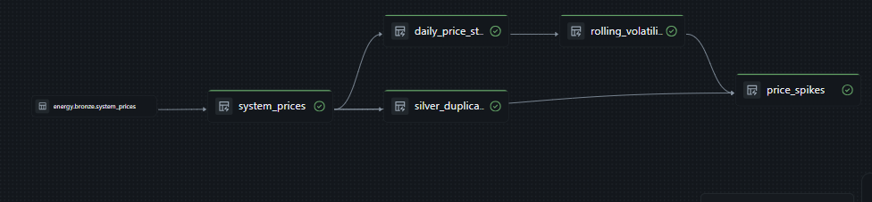

# energy-platform

A production-grade GB energy data platform on Databricks, built as a post-certification capstone to a deliberately high standard: **test-first, contract-driven, and deployed entirely through CI/CD** — no notebook-first development, no manual deploys.

It ingests half-hourly GB electricity system prices (imbalance/cash-out prices) from the [Elexon BMRS Insights API](https://bmrs.elexon.co.uk/), lands them through a quality-gated bronze layer, and derives a deduplicated silver layer and quant-oriented gold analytics via Lakeflow Declarative Pipelines.

**Method over features:** every pipeline function runs locally under pytest before the workspace ever sees it. The source API was explored first, its behaviour written down as a [data contract](docs/contracts/elexon_system_prices.md), and every schema, quality rule, and test specimen traces back to that contract.

---

## Architecture

 --> G3
```


**Two paradigms, one bundle, on purpose:**

- **Bronze is imperative** — a Python wheel job deployed via Databricks Asset Bundles. The source is a REST API with personality: retry-worthy 5xxs vs fail-fast 400s, partial current days that must be refetched, settlement reruns that re-serve revised rows, and a custom watermark grain. That is *do-things-in-order* logic, and it lives in tested Python.
- **Silver and gold are declarative** — Lakeflow Declarative Pipelines. Table-to-table derivation is *declare-what-tables-are* logic: the framework derives execution order from the dependency graph, and lineage, expectations, and monitoring come for free.
- The boundary follows the workload, not preference. If the source were files landing in storage, bronze would be Auto Loader and the whole medallion would be declarative.

## Design decisions

**Wheel-plus-LDP.** All pipeline intelligence — transforms, watermark planning, quality rules, analytics — lives in a tested Python package (`src/energy_platform`). The LDP definitions in `pipelines/` are thin declarative shells that import it. This keeps the logic unit-testable off-platform and portable to any Spark runtime; platform coupling is concentrated in the thin, re-expressible orchestration layer.

**Quality triage, not quality theatre.** Row-level breaches are quarantined with the rule they broke attached (bad data should be visible and separated — never silently dropped, never allowed to hold 47 good rows hostage). New rules enter as warnings and earn quarantine powers. A batch-level gate fails the run if >20% of a batch quarantines — but only *after* both tables are written: evidence lands before the alarm sounds. The gate has been fire-drilled in production with a deliberately corrupt row.

**Append-only bronze, stateless silver.** Bronze captures everything the source sends, duplicates and revisions included (the API serves whole days; the watermark tracks period-level completeness — mismatched grains are absorbed by append + downstream dedupe). Silver is a stateless full rebuild: one row per `(settlement_date, settlement_period)`, latest `created_datetime_utc` wins. At ~48 rows/day, rebuild beats incremental merge on simplicity and drift-immunity; the switch criterion (observed run time attributable to silver) is documented, not guessed.

**Uniqueness enforced where it belongs.** Duplicate keys are *expected* in bronze and *forbidden* in silver — the same check, different layers, different verdicts. In silver it is an LDP expectation (`expect_or_fail`) on a derived duplicate-key monitor table that must be empty.

**Honest auth.** CD authenticates with a scoped PAT held in GitHub Actions secrets — appropriate for a solo dev workspace. At a client this would be a service principal with federated credentials (no long-lived secret at all).

## Data quality

Rules are metadata-defined [DQX](https://github.com/databrickslabs/dqx) checks in [`quality.py`](src/energy_platform/quality.py), each traceable to a clause in the data contract:

| Rule | Tier | Rationale (from contract) |
|---|---|---|
| `settlement_period` in 1–50 | quarantine | 48 periods/day; 46/50 on clock-change days |
| `settlement_date`, `settlement_period`, `start_time_utc` not null | quarantine | key fields; null = unprocessable |
| sell/buy prices not null | quarantine | core measures |
| `system_sell_price = system_buy_price` | warn | single imbalance price since 2015 — divergence means regime change or corruption; flagged, not diverted |
| batch quarantine rate > 20% | fail run | systemic breach — the contract itself has moved |

Quarantined rows land in `energy.bronze.system_prices_quarantine` carrying DQX's `_errors` annotations naming the rule(s) broken.

## Gold analytics

Quant-oriented, model-ready tables (features, not models — forecasting work consumes gold, it doesn't live in it):

- **`daily_price_stats`** — daily price shape (mean/min/max/stddev), net imbalance volume, negative-period count, calendar features, and stationarity columns: first differences and *guarded* log returns (GB system prices can be zero or negative — log returns are null unless both days are positive, with the exclusion visible rather than silent).
- **`rolling_volatility`** — trailing 7d/30d realised volatility of daily changes, rolling means, z-score, and mean-reversion gap (the Ornstein–Uhlenbeck "distance from level" term). Early rows are honestly null until history accumulates.
- **`price_spikes`** — period-grain extreme cash-out events (|z| > 3 vs trailing stats), with NIV and derivation code. **Empty when the market is calm — empty is the healthy state**, and both directions of that contract are tested.

## Testing

- Three speed tiers: pure Python (microseconds — watermark planning, threshold gate), local Spark (transforms, dedupe, analytics), and Spark+DQX.
- Test data descends from real exploration output: one contract-faithful specimen builder (`make_raw_row`), surgically mutated per test, run through the *actual* production path (raw schema → standardise → dedupe → analytics).
- External calls are faked at injected seams (a stub HTTP session for the Elexon client; a mock `WorkspaceClient` for DQX) — the suite runs with no network and no credentials, which CI enforces by construction.
- A module-import smoke test catches load-time errors (bad annotations, stray imports) before any deploy.

Run it: `uv run pytest -v`

## CI/CD

- **CI** (`.github/workflows/ci.yml`): full test suite on every PR and push.
- **Gate**: `master` is protected — PRs only, and the `test` check must pass before the merge button unlocks (verified with a deliberately broken test: the gate refuses red).
- **CD** (`.github/workflows/cd.yml`): every merge to `master` re-runs the tests, validates the bundle, and deploys it to the workspace from GitHub's runner. The laptop is not in the deployment path.

## Running it

Prerequisites: [uv](https://docs.astral.sh/uv/), the [Databricks CLI](https://docs.databricks.com/dev-tools/cli/), a Unity Catalog workspace with an `energy` catalog and `bronze`/`silver`/`gold` schemas.

```bash
uv sync                                   # local env (tests run with no workspace at all)
uv run pytest -v

databricks auth login --host <workspace-url> -p <profile>
databricks bundle deploy -p <profile>
databricks bundle run ingest_prices -p <profile>     # bronze ingestion
databricks bundle run silver_pipeline -p <profile>   # silver + gold
```

## Roadmap

Parked deliberately, each with its trigger:

- **Incremental silver (MERGE + CDC patterns)** — as a labelled what-if scenario; at current volume the stateless rebuild wins, and the variant exists to demonstrate the pattern, not to run.
- **Ornstein–Uhlenbeck / jump-diffusion estimation notebook** — consumes `price_spikes` and `rolling_volatility` once enough history accumulates; kept downstream of gold to keep the feature/model boundary clean.
- **`periods_in_day()` calendar helper** — makes `is_complete_day` exact on the two clock-change days per year (currently approximated at 48 with a documented caveat).
- **Genie space + monitoring dashboard polish** — quarantine count, expectation pass rates, daily price and spike views.
- **Monthly rollups** — when there is more than one month to roll up.

## Alternatives

[`alternatives/`](alternatives/) contains the original imperative silver implementation (reader / overwrite writer / post-write integrity check), retired when the LDP version reproduced its row count exactly. It remains the right pattern for a non-LDP shop, and the two implementations side by side are the point: same problem, both paradigms, and a reasoned choice between them.

---

*Built by [Umar Ashraf](https://github.com/umarashrafdata-dev) (BI Matters Ltd) — Lead Data Engineer, Birmingham UK.*